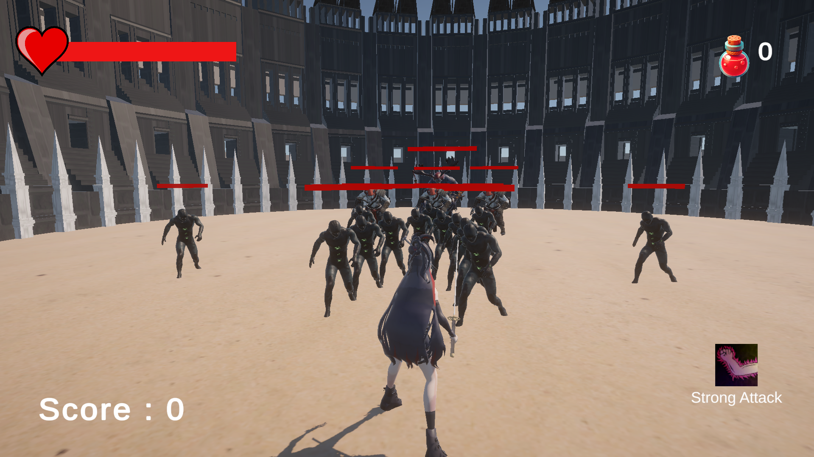
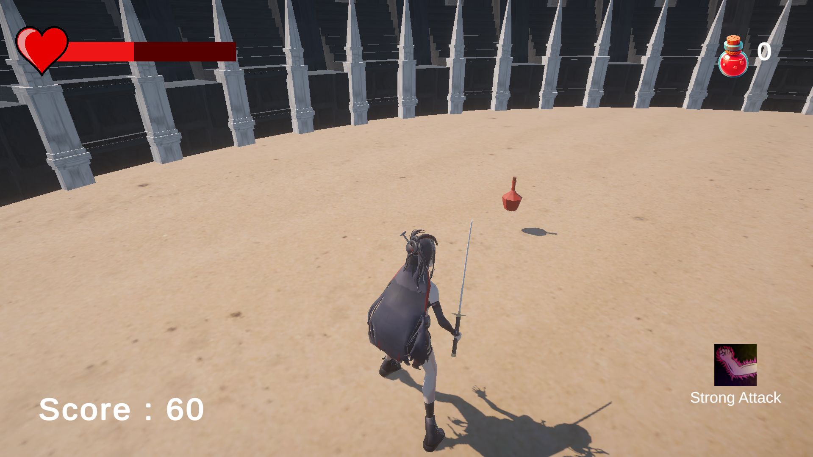
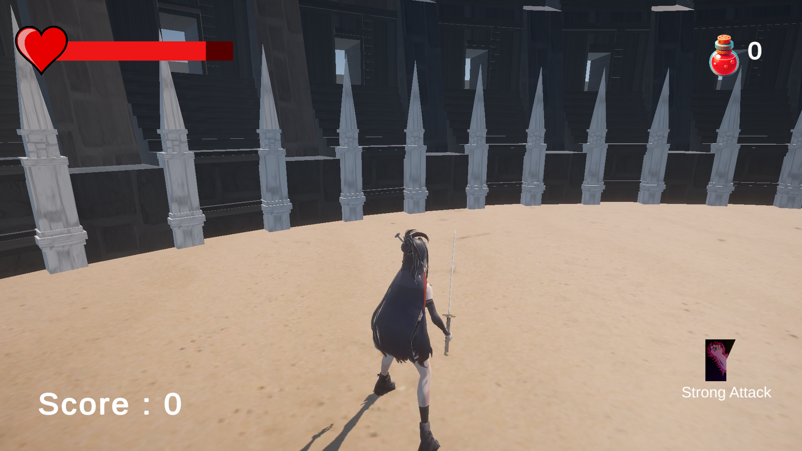
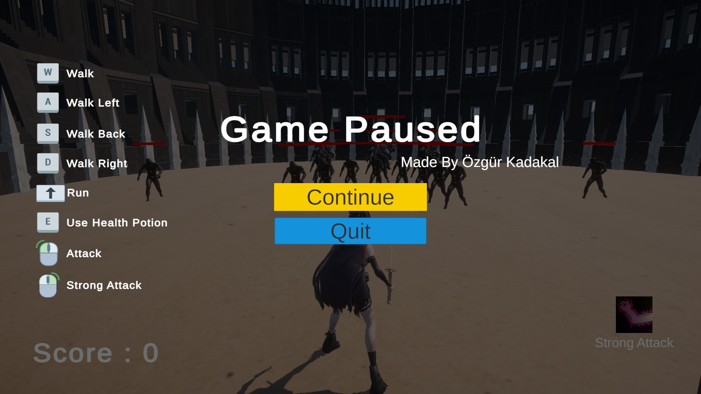
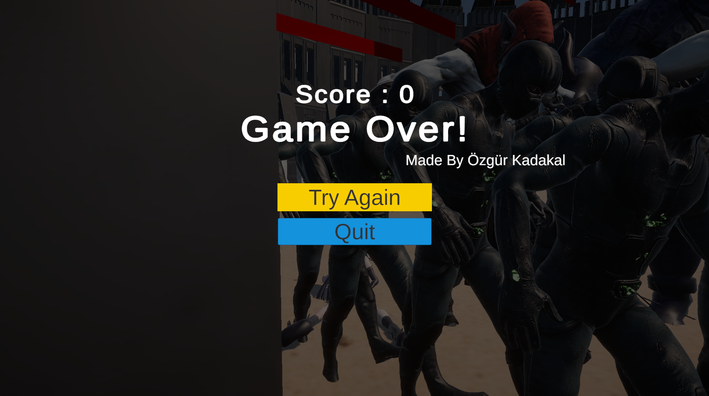
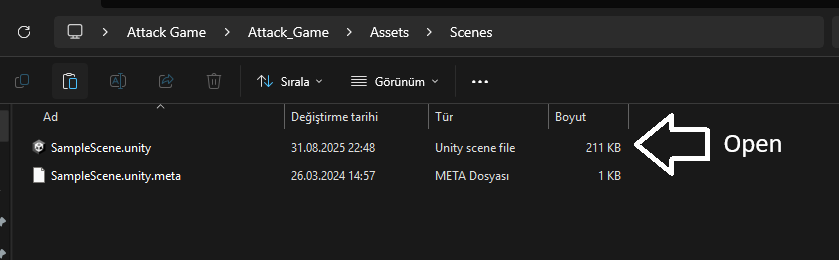
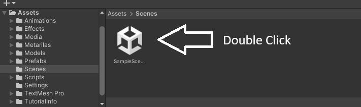

## 🌍 English

# ⚔️ AttackGame 🎮

### - Developed by Özgür Kadakal

**⚠️ Important:** Please extract the downloaded `.zip` file before opening the project. Otherwise, it may not work properly.

---

### 🖼️ Gameplay Previews

### 🎮 In-Game Screenshot 1

### 🎮 In-Game Screenshot 2

### 🎮 In-Game Screenshot 3

### 🎮 In-Game Screenshot 4

### 🎮 In-Game Screenshot 5

---

### ⚔️ AttackGame

AttackGame is a dynamic **samurai-style battle game** developed in Unity by **Özgür Kadakal**. Players use a **katana** to defeat enemies and survive as long as possible. The game includes smooth animations, immersive sound effects, and interactive gameplay mechanics.

### ✨ Features

* ⚔ Sword attacks to defeat enemies
* 🏃 Walking and running animations
* 🍷 Drinking potions with animation
* 🩸 Player death and Game Over sequence
* 🔊 Attack, death, walking, running, and potion sound effects
* 🏁 Game Over screen with sound effects
* ⏸ Pause the game with **ESC** key
* 🎹 ESC menu showing key controls
* 🎵 Background music
* ⚡ Timed special attacks
* 💖 Enemies drop health potions with a percentage chance
* ❤️ Player health bar
* 🎯 Player score display
* 🩺 Health potion count display
* 🛡 Enemy health bars

**Additional Notes:**

* 🤖 This project uses **AI systems**.
* ⚠️ The game has no known errors, but if any issue occurs, **delete the Library folder and reopen the project**.
* 🐞 Minor bugs may exist; please **report any issues** to me.

🧑‍💻 *This project was developed from scratch by Özgür Kadakal.*  
📌 *All code and assets are original.*

---

## 🖇️ Assets & References

* 🧍‍♂️ Player Model: [Link](#)
* ⚔ Katana Model: [Link](#)
* 🌳 Map Model: [Link](#)
* 👹 Enemy Models: [Link](#)
* 🔊 Sound Effects: [Link](#)
* 🏖 Sand Texture: [Link](#)
* 🪨 Stone Texture: [Link](#)

---

## 🛠 Unity Version

* **2022.3.62f1**

> This project was developed and tested with **Unity 2022.3.62f1**.

---

## ⚠️ Important Notice

1. When opening the project through Unity Hub for the first time, loading may take some time as Unity rebuilds the Library folder.
2. On first launch, the **Hierarchy may appear empty**.
   To load the game scene, open **`Assets/Scenes/SampleScene`**.

📸 **Screenshot:**  

  

  

---

## 📬 Contact

For any feedback, questions, or suggestions:
📧 [ozgurkreach@gmail.com](mailto:ozgurkreach@gmail.com)

---

## 🇹🇷 Türkçe

# ⚔️ AttackGame 🎮

### - Geliştirici: Özgür Kadakal

**⚠️ Önemli:** İndirdiğiniz `.zip` dosyasını ayıklayıp projeyi bu şekilde açınız. Aksi takdirde proje düzgün çalışmayabilir.

---

## 🖼️ Oynanış Önizlemeleri

### 🎮 Oyun İçi Görüntü 1

### 🎮 Oyun İçi Görüntü 2

### 🎮 Oyun İçi Görüntü 3

### 🎮 Oyun İçi Görüntü 4

### 🎮 Oyun İçi Görüntü 5

---

### ⚔️ AttackGame

AttackGame, Unity ile **Özgür Kadakal** tarafından geliştirilmiş dinamik bir **samuray temalı savaş oyunudur**. Oyuncular, düşmanları yenmek için **katana** kullanır ve mümkün olduğunca uzun süre hayatta kalmaya çalışır. Oyun, akıcı animasyonlar, ses efektleri ve etkileşimli oynanış özellikleri içerir.

### ✨ Özellikler

* ⚔ Düşmanları yenmek için kılıç saldırıları
* 🏃 Yürüme ve koşma animasyonları
* 🍷 İksir içme animasyonu
* 🩸 Oyuncu ölümü ve Game Over dizisi
* 🔊 Saldırı, ölüm, yürüyüş, koşu ve iksir içme ses efektleri
* 🏁 Game Over ekranı ve ses efekti
* ⏸ **ESC** tuşu ile oyunu duraklatma
* 🎹 ESC menüsünde tuş bilgileri
* 🎵 Oyun arka plan müziği
* ⚡ Süreli özel saldırılar
* 💖 Düşmanlardan belirli bir şansla can iksiri düşmesi ve içildiğinde can dolması
* ❤️ Oyuncu can barı
* 🎯 Oyuncu skor göstergesi
* 🩺 Can iksiri sayısı göstergesi
* 🛡 Düşmanlar için can göstergesi

**Ek Notlar:**

* 🤖 Bu projede **yapay zekadan faydalanılmıştır**.
* ⚠️ Oyunda bilinen bir hata yoktur; ancak olası bir sorun durumunda, **Library klasörünü silip projeyi tekrar açın**.
* 🐞 Ufak buglar olabilir; lütfen **karşılaştığınız durumları bana bildirin**.

🧑‍💻 *Bu proje Özgür Kadakal tarafından sıfırdan geliştirilmiştir.*  
📌 *Tüm kodlar ve içerikler özgündür.*

---

## 🖇️ Assets & References

* 🧍‍♂️ Oyuncu Modeli: [Link](#)
* ⚔ Katana Modeli: [Link](#)
* 🌳 Harita Modeli: [Link](#)
* 👹 Düşman Modelleri: [Link](#)
* 🔊 Ses Efektleri: [Link](#)
* 🏖 Kum Texture: [Link](#)
* 🪨 Taş Texture: [Link](#)

---

## 🛠 Unity Sürümü

* **2022.3.62f1**

> Proje **Unity 2022.3.62f1** sürümü ile geliştirilmiş ve test edilmiştir.

---

## ⚠️ Önemli Uyarı

1. Projeyi Unity Hub üzerinden ilk kez açarken yüklenme süresi uzun olabilir. Unity, Library klasörünü yeniden oluşturacaktır.
2. İlk açılışta **Hierarchy tamamen boş** görünebilir.
   Oyun sahnesini yüklemek için **`Assets/Scenes/SampleScene`** dosyasını açın.

📸 **Ekran Görüntüleri:**  

  

  

---

## 📬 İletişim

Her türlü geri bildirim, soru veya öneri için:
📧 [ozgurkreach@gmail.com](mailto:ozgurkreach@gmail.com)
